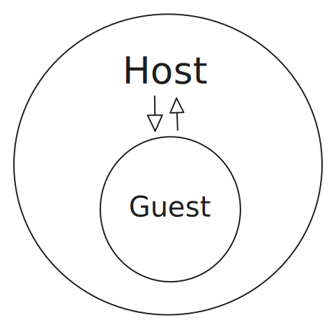

**[Yoke](https://yokecd.github.io/docs) is a package manager for Kubernetes that uses WebAssembly as its package format. However, there isn't a lot of information or many guides available on how to leverage WebAssembly (WASM) or the WebAssembly System Interface (WASI). From [Yoke](https://github.com/yokecd/yoke)'s perspective, WebAssembly is too valuable a tool to be kept under wraps. The following post explores what I have learned about WASM/WASI while building Yoke. Enjoy!**

<hr />

It’s no secret that the [yoke](https://github.com/yokecd/yoke) project is a big fan of WebAssembly.

WebAssembly allows us to compile our code into a single OS and architecture agnostic binary.
This compilation process is one way we package our code, making it ready to run safely on any host.

Beyond serving as the package format for [yoke flights](https://yokecd.github.io/docs/concepts/flights),
WebAssembly enables us to execute code within a sandbox, enforcing strict security guarantees.
When running a WASM module from Go, the module cannot access the host's memory, make syscalls, open file descriptors, or establish network connections.

This ensures that [yoke](https://github.com/yokecd/yoke) can run WASM Modules securely while preventing potentially untrusted code from compromising your system.

### But if this is true, how can yoke provide [Cluster-Access](https://yokecd.github.io/docs/concepts/cluster-access)?

For those who are not familiar, flights (WebAssembly compiled programs that generate Kubernetes resources) can be invoked with the flag `--cluster-access` to enable fetching resources from the cluster.

This feature may seem to contradict everything we have just said:

- We don’t want arbitrary code performing unrestricted actions in our cluster.
- If WebAssembly can’t open a socket, how can it communicate with the Kubernetes API?

Surprisingly, in the end, when the cookie crumbles, there is no contradiction: even with cluster-access, [yoke flights](https://yokecd.github.io/docs/concepts/flights) cannot perform arbitrary actions in your Kubernetes cluster.
And it remains true that a WebAssembly module cannot make network requests to the cluster to interact with it —

At least not directly.

Let’s take a closer look at how this works.

## Cluster-Access Behind the Scenes

**WebAssembly System Interface (WASI)** is a standard that enables WASM modules to interact with system resources.
As we will see, it allows the module to delegate tasks to the host.

WASM modules are executed by a host program. The most common environment for running WebAssembly is a web browser, but it is far from the only runtime available. Unsurprisingly, Node.js can also run WebAssembly, along with many other runtimes, including:

- Wasmtime
- Wasmer
- Wazero

[Yoke](https://github.com/yokecd/yoke) is built with Go, and so uses [wazero](https://github.com/tetratelabs/wazero), a pure Go runtime for WASM.

The Host runs the WASM module as a Guest within its own memory sandbox. It’s similar to a Russian doll, with the Host program containing a smaller Guest program within itself.

The Host can expose functions that the Guest can import and call. When the Guest WASM module invokes such a function, it yields control back to the Host, waits for it to execute the function, and then resumes execution.



> **_INFO:_** From this point onwards the term Host refers to the process running the WebAssembly Runtime.
> In our case this refers to the Yoke CLI.
> The Guest refers to the WebAssembly Module embedded within the Host Process.

If the user explicitly opts in, [yoke](https://github.com/yokecd/yoke) provides a single function to WASM modules: `k8s_lookup`.

This function is called by the Guest module but executed by the Host. This means that the WASM module cannot perform arbitrary actions; it can only invoke the behavior provided by `k8s_lookup`.

## Hurdles

Even though we can provide Host functions to the Guest, our task is not over yet.  
WebAssembly is, after all, an assembly-like language. It only supports basic numeric types and does not natively support strings or structs.

> **_NOTE:_** WASI Preview 2 introduces the component model, allowing us to define types that both the Host and Guest can understand.  
> However, [wazero](https://github.com/tetratelabs/wazero) does not support this yet, opting instead for WASI Preview 1.

Despite these limitations, if we look at the yoke Cluster-Access API, it appears quite high-level:

```go
package main

import (
  corev1 "k8s.io/api/core/v1"
  "github.com/yokecd/yoke/pkg/flight/wasi/k8s"
)

func main() {
  secret, err := k8s.Lookup[corev1.Secret](k8s.ResourceIdentifier{
    Name:       "shhh",
    Namespace:  "default",
    APIVersion: "v1",
    Kind:       "Secret",
  })

  // ...
}
```

One of the most difficult challenges when we first start working with WebAssembly is understanding how to pass data between the Host and Guest.

To this end, it may be useful to examine the signature of the `k8s_lookup` function provided by the Host:

```go
//go:wasmimport host k8s_lookup
func lookup(state uint32, name, namespace, kind, apiversion uint64) uint64
```

This may feel like witchcraft — and maybe it is.

The first thing we need to know is that WebAssembly modules use a 32 bit-address space.
This means that any memory address within the module can be represented by a 32-bit integer.

The second thing we need to know is that strings (and by extension, byte slices) can be represented
as a pointer to the start of the string and its length.
Hence, a 32-bit integer for the address of the string and a 32-bit integer for the length of the string—or a single 64-bit integer.

The third thing we need to know is that the Host program owns the Guest module and its memory sandbox.
This means that the Host program can read from the WebAssembly module's memory. If the module declares a string and passes the address and length to the Host, the Host can read the string from the Guest's memory.

Now that we know these facts, the magic behind the function signature starts to fall away.

We can start thinking about those integer types as representing arbitrary data:

```go
package wasm

type String  uint64  // 32-bit Address + 32-bit Length.
type Buffer  uint64  // Buffer is a []byte. Same reasoning as a string applies.
type Pointer uint32  // We can represent any pointer as a 32-bit address.
```

And the `k8s_lookup` function can be rewritten like so:

```go
//go:wasmimport host k8s_lookup
func lookup(state wasm.Pointer, name, namespace, kind, apiversion wasm.String) wasm.Buffer
```

This should now make much more intuitive sense. Given the strings `name`, `namespace`, `kind`, and `apiVersion`, we can look up a Kubernetes resource on the Host, serialize it as JSON, and pass it back to the Guest as a `[]byte`.

However there are still some details that elude us:

- How do we translate strings from the Guest into uint64 integer values for the Host to consume?
  - And relatedly, how do we read the data from the wasm.Buffer (a uint64) as a `[]byte`?
- How do we return a Buffer from the Host to the Guest, when the Guest cannot reach outside itself to read Host memory?
- What is the state pointer and what does it do?

### Translating data to numeric types and back again

#### Guest Perspective

From the perspective of the Guest WebAssembly module, we have strings and buffers that we want to transform into `uint64` values. The strategy that [yoke](https://github.com/yokecd/yoke) uses is to represent the address of the string as the first 32 bits, and the length as the last 32 bits:

```go
import "unsafe"

type Buffer uint64

// FromString converts a []byte value into a uint64 representing its address and length.
func FromSlice(buffer []byte) Buffer {
  if len(buffer) == 0 {
    // 0 length slices can be reduced to no value.
    // We cannot take the address of the first element as it does not exist so we represent
    // this as 0.
    return 0
  }
  // Unsafe conversion rules:
  // - Any pointer can be cast to an unsafe.Pointer.
  // - An unsafe.Pointer can be cast to a uintptr.
  // - A uintptr is a normal numeric type that can be cast to other numeric types.
  //
  // We know the address will be a 32-bit value since we are in the Guest Space.
  // We therefore left shift into the 32 upper bits of our uint64.
  address := uint64(uintptr(unsafe.Pointer(&buffer[0]))) << 32
  length := uint64(uint32(len(buffer)))
  return Buffer(address | length)
}

// Address returns the address of a buffer as a 32-bit integer.
func (buffer Buffer) Address() uint32 {
 return uint32(buffer >> 32)
}

// Length returns the length of a buffer as a 32-bit integer.
func (buffer Buffer) Length() uint32 {
 return uint32(buffer)
}

// Slice the data at the address of the buffer, for the amount of the length of the buffer
// and returns the memory as a []byte.
func (buffer Buffer) Slice() []byte {
  if buffer == 0 {
    // Guard against the 0 length buffers.
    return nil
  }
  return unsafe.Slice(
    (*byte)(unsafe.Pointer(uintptr(buffer.Address()))),
    buffer.Length(),
  )
}
```

Doing the same for the `wasm.String` type maps one to one with our `wasm.Buffer` example, and in the spirit of a university textbook,
will be left as an exercise for the reader.

#### Host Perspective

We have now seen how to work with strings and buffers from the perspective of the Guest: just a little unsafe pointer magic.
However, the Host is slightly different. The Guest module assumes that it is the entire world, and as such uses the pointers to variables
and passes those values up to the Host. The Host, on the other hand, needs to interpret those values in the context of the Guest's memory space.

With [wazero](https://github.com/tetratelabs/wazero), this is quite easy since Host functions by convention start with a reference to the Guest module.

Hence, we can build helpers to read our values in from the Guest Module's memory.

```go
import "github.com/tetratelabs/wazero/api"

func LoadBuffer(module api.Module, buffer wasm.Buffer) []byte {
  data, ok := module.Memory().Read(buffer.Address(), buffer.Length())
  if !ok {
    panic("memory read out of bounds")
  }
  return data
}
```

This leaves us with one final problem from the Host's perspective. How do we return our response to the Guest?
We know how to read memory from the Guest. However, we need to be able to write to the Guest. We cannot create a `[]byte`
on the Host and expect the Guest to be able to read from it. The Guest cannot see beyond its memory sandbox.

The Host can reach into the Guest, but the Guest cannot reach out into the Host.

Fortunately, Go 1.24 allows us to export functions from our Guest Module to the Host.
This way we can create a simple `malloc` function on the Guest side to create our `wasm.Buffer` of the appropriate size,
give the reference to the Host and let it write the response to it.

In Go, the easiest way to allocate (malloc) memory, is to `make` a byte slice.

```go
// Guest code

// We want to export a malloc function to allow the Host to allocate memory within the Guest.

//go:wasmexport malloc
func malloc(size uint32) wasm.Buffer {
  // FromSlice is defined above (if you've forgotten about it).
  return FromSlice(make([]byte, size))
}
```

This allows us to call it from the Host:

```go
// Host code

func Malloc(module api.Module, data []byte) wasm.Buffer {
  // ExportedFunctions take in a variadic amount of uint64 as arguments and return the same as results.
  // This is because Call doesn't know the size of the arguments or results, and so must default to the
  // largest possible numeric value it can handle.
  results, err := module.ExportedFunction("malloc").Call(ctx, uint64(len(data)))
  if err != nil {
    // if we cannot malloc, let's crash with gumption.
    panic(err)
  }

  // The first item in the result will be the returned value from the Guest function.
  buffer := wasm.Buffer(results[0])

  // Write the data to the buffer we allocated for this bespoke purpose.
  module.Memory().Write(buffer.Address(), data)

  // And return it!
  return buffer
}
```

### Representing Error values

The final point we have left to address is how do we return our value or an error?

In Go, we are allowed to return more than one value. However, we do not have such a luxury when working with WASM.

After all we have read so far about passing around pointers, and allocating memory, and reading it from modules or loading it in via unsafe,
we have all the tools we need to come up with a solution. And in fact, there are many possible ways of representing our return values from the
Host to the Guest. We could create a data type for containing multiple values or have a type field to indicate what kind of value we have.

Anything would work as long as the Host and the Guest agree on the convention.

[yoke](https://github.com/yokecd/yoke) uses a `wasm.State` enum (or as close to an enum as you get in Go) to let the Guest know what kind of return value it is getting.
At the time of writing, it looks like this:

```go
type State uint32

const (
 StateOK State = iota
 StateFeatureNotGranted
 StateError
 StateNotFound
 StateUnauthenticated
 StateForbidden
)
```

This allows us to define the state of the Host function call, and let the Guest interpret the returned buffer accordingly.
Those states resemble HTTP errors, naturally because the use-case [yoke](https://github.com/yokecd/yoke) has is to talk to the Kubernetes API.

However, they are meant to be generic, common-sense, grass-fed errors you would expect to see in the wild.
Packages can use these states to build upon their own error types.

And so we have finally arrived at the mystery of the `k8s_lookup` state pointer argument.

The Guest creates a state variable and passes its pointer to the Host.
The Host does its logic, and writes the state value to it before returning a result.
If no error occurred it can leave it as its zero value: `StateOK`. If an error occurred it can set the state to the
most semantically meaningful state for the Guest to use.

This allows us to create a nice little error creation helper for the Host:

```go
func Error(ctx context.Context, module api.Module, ptr Ptr, state State, err string) Buffer {
  // Write the state enum value to the location in memory where we keep the state.
  module.Memory().WriteUint32Le(uint32(ptr), uint32(state))
  // Write the error data to a newly allocated Buffer using Malloc defined above.
  return Malloc(ctx, module, []byte(err))
}
```

We can then use it to construct error responses from the Host to the Guest.

```go
import kerrors "k8s.io/apimachinery/pkg/api/errors"

deployment, err := client.CoreV1().Deployments("default").Get("example", metav1.GetOptions{})
if kerrors.IsNotFound(err) {
  return Error(ctx, module, stateRef, wasm.StateNotFound, err.Error())
}

// Use deployment ...
```

Then the Guest simply needs to check the state value, and interpret the data in the returned Buffer accordingly.

## Putting It All Together

Now we have all the bits and pieces required for defining a Host function, and calling it from the Guest.

Some of the details on the Host are specific to [wazero](https://github.com/tetratelabs/wazero) such as their API for building Host-Modules.
The basic gist of it is that [wazero](https://github.com/tetratelabs/wazero) lets you define Host functions where the first two arguments are the `context.Context` and `api.Module`,
the following arguments are the ones the Guest will use.

```go
hostModule := runtime.
  NewHostModuleBuilder("host").
  NewFunctionBuilder().
  WithFunc(func(ctx context.Context, module api.Module, state wasm.Pointer, name, namespace, kind, apiVersion wasm.String) wasm.Buffer {
    // Do the lookup on the host, and write results back to the module via its memory.


    // DoLookup is our way to hand-wave the details of looking up kubernetes resources.
    // Feel free to let me know if a blog post on interacting with the K8s API would be interesting!
    resource, err := DoLookup(
      // We load the actual strings from the Guest module's memory using their uint64 representations.
      wasi.LoadString(module, name),
      wasi.LoadString(module, namespace),
      wasi.LoadString(module, kind),
      wasi.LoadString(module, apiVersion),
    );
    if err != nil {
      if kerrors.IsNotFound(err) {
        return wasi.Error(module, state, wasm.StateNotFound, err.Error())
      }
      return wasi.Error(module, state, wasm.StateError, err.Error())
    }

    data, err := json.Marshal(resource)
    if err != nil {
      return wasi.Error(module, state, wasm.StateError, err.Error())
    }

    return Malloc(ctx, module, data)
  }).
  Export("k8s_lookup")
```

Then from the Guest we can import this function using the namespace `host` and the function name `k8s_lookup`.

Replicating something similar to [yoke](https://github.com/yokecd/yoke)'s `pkg/wasi/k8s` package we get:

```go
package k8s

//go:wasmimport host k8s_lookup
func lookup(state wasm.Ptr, name, namespace, kind, apiVersion wasm.String) wasm.Buffer

type ResourceIdentifier struct {
 Name       string
 Namespace  string
 Kind       string
 ApiVersion string
}

// Lookup is our public interface that wraps our k8s_lookup function imported from the Host
// and provides a nice high-level API for our users.
//
// It folows our convention of generating a state variable for the Host to signal back
// the state of the result.
//
// It calls our imported lookup function with the appropriate arguments converted
// to their uint64 representations (wasm.String defined above).
//
// Some logic from the yoke project has been omitted to soley focus on the WebAssembly related aspects.
func Lookup[T any](identifier ResourceIdentifier) (*T, error) {
 var state wasm.State

 buffer := lookup(
  wasm.PtrTo(&state),
  wasm.FromString(identifier.Name),
  wasm.FromString(identifier.Namespace),
  wasm.FromString(identifier.Kind),
  wasm.FromString(identifier.ApiVersion),
 )

 switch state {
 case wasm.StateOK:
  var resource T
  if err := json.Unmarshal(buffer.Slice(), &resource); err != nil {
   return nil, err
  }
  return &resource, nil
 case wasm.StateFeatureNotGranted:
  return nil, ErrorClusterAccessNotGranted
 case wasm.StateError:
  return nil, errors.New(buffer.String())
 case wasm.StateForbidden:
  return nil, ErrorForbidden(buffer.String())
 case wasm.StateNotFound:
  return nil, ErrorNotFound(buffer.String())
 case wasm.StateUnauthenticated:
  return nil, ErrorUnauthenticated(buffer.String())

 default:
  panic("unknown state")
 }
}
```

## Conclusion

Through this exploration, we've delved into the intricate dance between Host programs and their Guest WebAssembly modules. By leveraging numeric types and a bit of pointer magic, we've managed to facilitate effective communication between these two realms.

We've also highlighted some of the type abstractions employed by [yoke](https://github.com/yokecd/yoke) to make working with `Strings` and `Buffers` more intuitive and manageable.

Finally, we've examined various conventions for representing data of different types, showing how to pass complex data structures and errors back and forth between the Host and Guest.

I hope this deep dive into WebAssembly interfacing inspires you to experiment and innovate with WebAssembly in your own projects. Happy tinkering!

## Post-Word

I, the author, am not an expert at technical writing, nor WebAssembly. If anything feels wrong or can be better expressed
please suggest an edit to this post! Thanks for reading!

